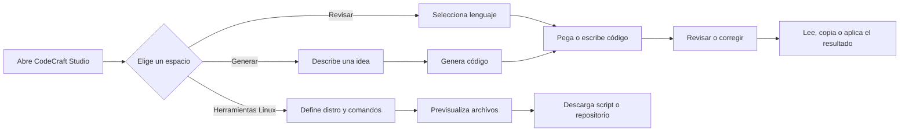
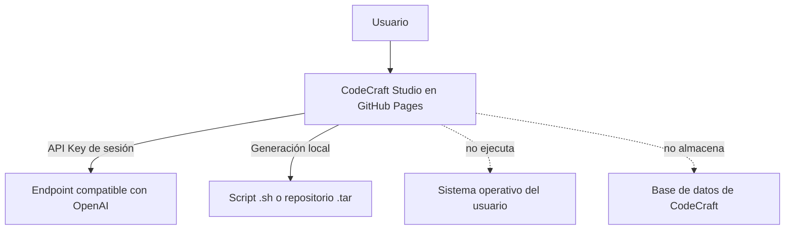
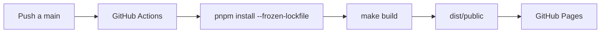

# CodeCraft Studio

> **Escribe, revisa, genera y empaqueta código desde el navegador.** CodeCraft Studio combina un editor Monaco, revisión asistida por OpenAI y un constructor de herramientas Bash para distribuciones Linux, todo publicado como una aplicación estática en GitHub Pages.

[](https://hubgunter4-ops.github.io/codecraft-studio/)
[](https://hubgunter4-ops.github.io/codecraft-studio/#/review)
[](https://hubgunter4-ops.github.io/codecraft-studio/#/tools)

## Índice

- [Qué puedes hacer](#qué-puedes-hacer)
- [Recorrido visual](#recorrido-visual)
- [Abrir la aplicación](#abrir-la-aplicación)
- [Revisar y corregir código](#revisar-y-corregir-código)
- [Generar código desde una descripción](#generar-código-desde-una-descripción)
- [Crear herramientas Linux](#crear-herramientas-linux)
- [Formatos de salida](#formatos-de-salida)
- [Privacidad y API Key](#privacidad-y-api-key)
- [Desarrollo local](#desarrollo-local)
- [Validación y despliegue](#validación-y-despliegue)
- [Estructura del proyecto](#estructura-del-proyecto)
- [Solución de problemas](#solución-de-problemas)
- [Licencia y referencias](#licencia-y-referencias)

## Qué puedes hacer

| Módulo                 | Función                                                          | Resultado                                                    |
| ---------------------- | ---------------------------------------------------------------- | ------------------------------------------------------------ |
| **Revisar**            | Escribir o pegar código, elegir lenguaje y solicitar un análisis | Resumen, hallazgos y recomendaciones en Markdown             |
| **Corregir**           | Pedir una versión corregida conservando la intención original    | Código corregido y explicación de cambios                    |
| **Generar**            | Describir lo que quieres construir                               | Código editable en Monaco Editor                             |
| **Herramientas Linux** | Definir una utilidad para una distribución concreta              | Script Bash o repositorio portable descargable               |
| **Exportar**           | Copiar archivos o descargar resultados                           | `.sh` individual o archivo `.tar` con estructura de proyecto |

La aplicación está pensada para trabajar **desde el navegador**. GitHub Pages sirve el frontend estático [1]; las solicitudes de revisión se envían directamente desde el cliente al endpoint compatible con OpenAI que el usuario configure [4].

## Recorrido visual

El flujo principal se puede entender así:



La arquitectura de privacidad es deliberadamente simple:



> **Idea central:** CodeCraft puede generar un archivo que luego ejecutes tú, pero no ejecuta comandos Linux dentro del navegador ni sube automáticamente el script a un servidor.

## Abrir la aplicación

La versión desplegada está disponible en:

**[https://hubgunter4-ops.github.io/codecraft-studio/](https://hubgunter4-ops.github.io/codecraft-studio/)**

| Vista             | URL en GitHub Pages                                                           | Propósito                                |
| ----------------- | ----------------------------------------------------------------------------- | ---------------------------------------- |
| Inicio / revisión | [`/#/review`](https://hubgunter4-ops.github.io/codecraft-studio/#/review)     | Revisar y corregir código                |
| Generación        | [`/#/generate`](https://hubgunter4-ops.github.io/codecraft-studio/#/generate) | Crear código desde una descripción       |
| Constructor Linux | [`/#/tools`](https://hubgunter4-ops.github.io/codecraft-studio/#/tools)       | Crear scripts o repositorios ejecutables |

GitHub Pages usa **hash routing** en esta aplicación para que las rutas internas funcionen como archivos estáticos y no devuelvan un 404 al recargar la página [1].

## Revisar y corregir código

### Paso 1: configurar la sesión

Abre la aplicación y pulsa **Configurar API Key**. Introduce una clave compatible con OpenAI y, si utilizas otro proveedor compatible, cambia también la **URL base**. Las URL remotas deben usar HTTPS; HTTP solo se acepta para `localhost` y `127.0.0.1`.

La clave no se escribe en el repositorio ni en el bundle de producción. Para más detalles, consulta [Privacidad y API Key](#privacidad-y-api-key).

### Paso 2: seleccionar el lenguaje

El editor admite 16 lenguajes con resaltado y autocompletado de Monaco:

| Lenguajes disponibles                                            |
| ---------------------------------------------------------------- |
| JavaScript · TypeScript · Python · Java · Go · Rust · HTML · CSS |
| JSON · SQL · C# · C++ · PHP · Ruby · Kotlin · Swift              |

### Paso 3: escribir o pegar código

Puedes comenzar desde el ejemplo inicial, limpiar el editor o pegar un archivo existente. El contenido permanece en el estado de la sesión hasta que recargas o cierras la pestaña.

### Paso 4: solicitar una operación

| Acción              | Qué devuelve                                        |
| ------------------- | --------------------------------------------------- |
| **Revisar código**  | `## Resumen`, `## Hallazgos` y `## Recomendaciones` |
| **Corregir con IA** | Un bloque de código completo y `## Qué cambió`      |
| **Copiar**          | Copia el resultado visible al portapapeles          |

Un flujo de revisión típico se ve así:

```text
Código fuente
    ↓
Selección de lenguaje
    ↓
Revisión asistida
    ↓
Hallazgos priorizados
    ↓
Corrección opcional
    ↓
Comparación manual y copia del resultado
```

> Revisa siempre las modificaciones propuestas antes de incorporarlas a un proyecto real. Una respuesta generada no sustituye las pruebas, el análisis estático ni la revisión humana.

## Generar código desde una descripción

1. Abre [`/#/generate`](https://hubgunter4-ops.github.io/codecraft-studio/#/generate).
2. Escribe una petición concreta, por ejemplo: `Crea una CLI en Python que lea un CSV y muestre los registros duplicados.`
3. Selecciona el lenguaje de salida.
4. Pulsa **Generar código**.
5. Revisa y edita el resultado en Monaco.
6. Cambia a **Revisar código** para pedir un análisis adicional.

Una buena descripción especifica el lenguaje, la entrada, la salida y las restricciones:

```text
Crea una herramienta Bash compatible con Ubuntu 22.04 que:
- acepte una ruta como argumento;
- compruebe si el directorio existe;
- liste los archivos modificados durante las últimas 24 horas;
- termine con un código de salida distinto de cero si la ruta no existe.
```

## Crear herramientas Linux

Abre [`/#/tools`](https://hubgunter4-ops.github.io/codecraft-studio/#/tools) para acceder al constructor. Esta vista genera plantillas deterministas en el navegador; no necesita API Key.

### Paso 1: describir la herramienta

Completa estos campos:

| Campo             | Ejemplo                                  | Recomendación                                             |
| ----------------- | ---------------------------------------- | --------------------------------------------------------- |
| Nombre            | `sys-check`                              | Usa minúsculas, números y guiones                         |
| Descripción       | `Muestra información básica del sistema` | Explica el resultado esperado                             |
| Distribución      | `Ubuntu / Debian`                        | Elige la familia donde se instalará                       |
| Paquetes          | `curl jq`                                | Separa nombres por espacios; no introduzcas comandos aquí |
| Comando principal | `uname -a && df -h /`                    | Usa órdenes Bash que hayas revisado                       |

Las distribuciones y gestores incluidos son:

| Distribución                          | Gestor utilizado por la plantilla |
| ------------------------------------- | --------------------------------- |
| Ubuntu / Debian, Linux Mint, Pop!\_OS | `apt-get`                         |
| Fedora / RHEL, Rocky, AlmaLinux       | `dnf`                             |
| Arch Linux, Manjaro                   | `pacman`                          |
| Alpine Linux                          | `apk`                             |
| openSUSE, SLES                        | `zypper`                          |

### Paso 2: elegir la salida

#### Script completo

Genera un único archivo ejecutable, por ejemplo `sys-check.sh`, con:

- encabezado Bash y `set -Eeuo pipefail`;
- ayuda integrada con `--help`;
- modo de simulación `--dry-run`;
- instalación de dependencias según la distribución;
- ejecución del comando principal;
- mensajes de progreso y errores básicos.

#### Repositorio

Genera una estructura portable como esta:

```text
sys-check/
├── bin/
│   └── sys-check       # Script principal ejecutable
├── tests/
│   └── smoke.sh        # Comprobación de --help y --dry-run
├── README.md           # Uso, compatibilidad y advertencias
├── Makefile            # run, install y check
├── .gitignore
└── LICENSE
```

### Paso 3: revisar la previsualización

Antes de descargar, selecciona cada archivo en el panel derecho. Comprueba especialmente:

1. Que la distribución elegida sea la correcta.
2. Que los nombres de los paquetes existan en ese gestor.
3. Que el comando principal no borre, sobrescriba o transmita datos inesperadamente.
4. Que los argumentos y rutas estén correctamente escapados.
5. Que la opción `--dry-run` muestre lo que se ejecutaría.

### Paso 4: descargar y probar

Para un script individual:

```bash
chmod +x sys-check.sh
./sys-check.sh --help
./sys-check.sh --dry-run
./sys-check.sh
```

Para un repositorio descargado como `sys-check.tar`:

```bash
mkdir sys-check-review
tar -xf sys-check.tar -C sys-check-review
cd sys-check-review

# Revisa el contenido antes de ejecutar nada.
find . -maxdepth 3 -type f -print
sed -n '1,220p' bin/sys-check

# Ejecuta primero la comprobación no destructiva.
make check
make run

# Solo después de revisar el script, ejecútalo.
./bin/sys-check --dry-run
./bin/sys-check
```

Un repositorio generado no debe considerarse confiable automáticamente. El archivo `README.md` incluido documenta el objetivo y la compatibilidad, pero la revisión final de comandos corresponde al usuario.

## Formatos de salida

| Salida      | Descarga     | Cuándo usarla                                                       |
| ----------- | ------------ | ------------------------------------------------------------------- |
| Script      | `nombre.sh`  | Pruebas rápidas, automatizaciones personales o una utilidad pequeña |
| Repositorio | `nombre.tar` | Compartir, versionar, probar y extender una herramienta             |

La descarga se crea mediante APIs del navegador. CodeCraft no necesita permisos de escritura en el sistema de archivos para mostrar la previsualización.

## Privacidad y API Key

La API Key se guarda únicamente en `sessionStorage` durante la sesión de la pestaña [3] y se envía directamente al endpoint seleccionado.
No se incorpora al bundle, no se publica en GitHub y no se guarda en una base de datos.

| Recomendación                                     | Motivo                                                                    |
| ------------------------------------------------- | ------------------------------------------------------------------------- |
| Utiliza una clave con límites de gasto            | Reduce el impacto de un uso accidental o exposición local                 |
| No uses una clave personal en equipos compartidos | Las extensiones y el perfil del navegador pueden acceder al entorno local |
| Revoca la clave cuando termines                   | Limita la ventana de exposición                                           |
| Usa HTTPS para endpoints remotos                  | Evita enviar credenciales mediante HTTP sin cifrar                        |
| No pegues secretos en el editor                   | El código se incluye en las peticiones que tú solicites                   |

La aplicación utiliza `https://api.openai.com/v1` y el modelo `gpt-4o-mini` por defecto. También acepta otros endpoints compatibles con la API de chat si cumplen el mismo contrato.

## Desarrollo local

### Requisitos

Necesitas Node.js, pnpm y Git. La versión de pnpm del proyecto está fijada mediante `packageManager` y el workflow de despliegue usa pnpm `10.34.5`.

### Instalación y ejecución

```bash
git clone https://github.com/hubgunter4-ops/codecraft-studio.git
cd codecraft-studio
make install
make dev
```

Abre [http://localhost:3000](http://localhost:3000). En desarrollo local las rutas disponibles son `/review`, `/generate` y `/tools`; en GitHub Pages se utilizan las variantes con hash.

### Comandos del proyecto

| Comando        | Acción                                      |
| -------------- | ------------------------------------------- |
| `make install` | Instala dependencias con lockfile congelado |
| `make dev`     | Inicia el servidor de desarrollo            |
| `make check`   | Ejecuta TypeScript sin emitir archivos      |
| `make test`    | Ejecuta las pruebas Vitest                  |
| `make build`   | Construye cliente y bundle de servidor      |

## Validación y despliegue

Antes de abrir un pull request o publicar cambios, ejecuta:

```bash
make install
pnpm audit --prod
pnpm audit --dev
make check
make test
GITHUB_ACTIONS=true make build
git diff --check
```

El workflow [`deploy-pages.yml`](.github/workflows/deploy-pages.yml) se ejecuta cuando cambia `main`. Instala las dependencias con `--frozen-lockfile`, construye `dist/public`, sube el artefacto y despliega GitHub Pages.



## Estructura del proyecto

```text
client/
└── src/
    ├── components/       # Componentes reutilizables y UI
    ├── contexts/         # Tema y estado transversal
    ├── pages/
    │   ├── Home.tsx      # Revisión y generación de código
    │   ├── NotFound.tsx   # Página 404
    │   └── ToolBuilder.tsx# Constructor Linux
    ├── App.tsx           # Rutas y hash routing
    └── index.css         # Tokens visuales y estilos globales
server/
├── routers.ts            # Procedimientos tRPC
└── *.test.ts             # Pruebas Vitest
.github/workflows/
└── deploy-pages.yml      # Build y publicación
Makefile                  # Comandos de desarrollo
pnpm-workspace.yaml       # Overrides y parche de dependencias
```

## Solución de problemas

### La página muestra un 404 al abrir una ruta

Usa la variante con hash, por ejemplo [`/#/tools`](https://hubgunter4-ops.github.io/codecraft-studio/#/tools), y fuerza una recarga si el navegador conserva un bundle anterior.

### La revisión devuelve un error de API

Comprueba que la API Key sea válida, que la URL base termine en `/v1` cuando el proveedor lo requiera y que el endpoint responda a `POST /chat/completions`. Revisa también límites de cuota, conexión y código HTTP mostrado por la interfaz.

### El script generado no instala paquetes

Confirma que el gestor corresponda a la distribución, que el paquete exista en sus repositorios y que el sistema tenga `sudo` cuando el script necesite instalar dependencias. Ejecuta primero `--dry-run` y lee el archivo completo antes de darle permisos.

### El archivo TAR no se abre

Comprueba que la descarga no esté vacía y utiliza:

```bash
file sys-check.tar
tar -tf sys-check.tar
```

### El build local falla

Elimina instalaciones incompletas y vuelve a usar el lockfile del proyecto:

```bash
rm -rf node_modules
make install
make check
make test
```

## Licencia y referencias

Este repositorio contiene una aplicación de demostración y plantillas generadas. Revisa las licencias de las dependencias y de cualquier código generado antes de distribuirlo como producto.

La documentación de hash routing, almacenamiento de sesión, GitHub Pages y la API de referencia se apoya en las siguientes fuentes oficiales:

[1]: https://docs.github.com/en/pages "GitHub Pages Documentation"
[2]: https://docs.github.com/en/actions "GitHub Actions Documentation"
[3]: https://developer.mozilla.org/en-US/docs/Web/API/Web_Storage_API "MDN — Web Storage API"
[4]: https://platform.openai.com/docs/api-reference "OpenAI API Reference"
[5]: https://pnpm.io/cli/install "pnpm CLI Documentation"
